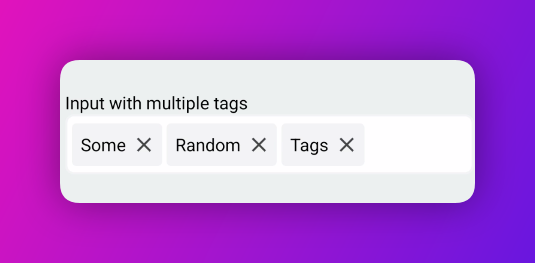

# react-native-autocomplete-multiselect

Lightweight, flexible dropdown picker for React Native, featuring autocomplete (typeahead) functionality. It emulates the ```<select>``` interfaces for each platform (android, ios), making it ideal for use cases like tagging, contact lists, country selection, or any functionality requiring list-based selection.

## Installation

```sh
npm install react-native-autocomplete-multiselect
```

## Usage


### Option 1: Input with multiple freeform tags
```js
import { Input } from 'react-native-autocomplete-multiselect';

<Input
  multiple
  onChange={(value) => console.log('onChange', value)}
  tagProps={{
    onChange: (tags) => console.log('onChange', tags),
    showRemoveButton: true,
  }}
/>
```


## Contributing

See the [contributing guide](CONTRIBUTING.md) to learn how to contribute to the repository and the development workflow.

## License

MIT

---

Made with [create-react-native-library](https://github.com/callstack/react-native-builder-bob)
