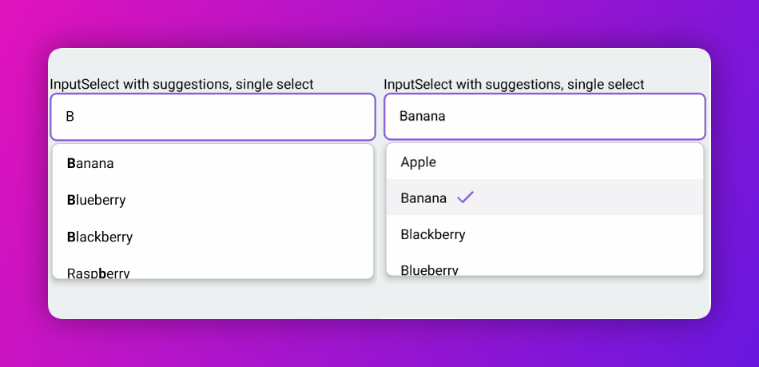
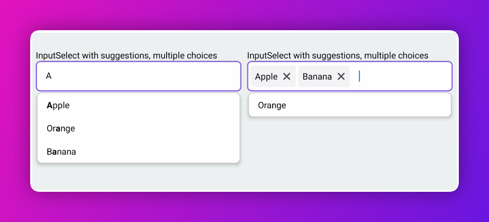
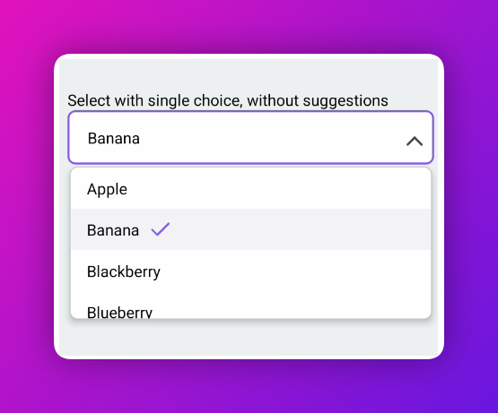
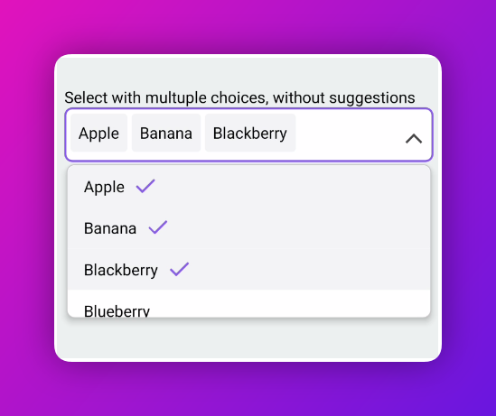
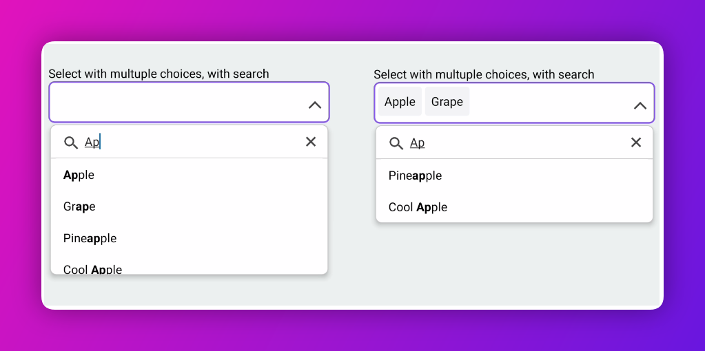

# react-native-autocomplete-multiselect

Lightweight, flexible dropdown picker for React Native, featuring autocomplete (typeahead) functionality. It emulates the ```<select>``` interfaces for each platform (android, ios), making it ideal for use cases like tagging, contact lists, country selection, or any functionality requiring list-based selection.

## Installation

```sh
npm install react-native-autocomplete-multiselect
```

## Usage


### Option 1: Input with multiple freeform tags
```js
import { Input } from 'react-native-autocomplete-multiselect';

<Input
  multiple
  onChange={(value) => console.log('onChange', value)}
  tagProps={{
    onChange: (tags) => console.log('onChange', tags),
    showRemoveButton: true,
  }}
/>
```


### Option 2: InputSelect with suggestions, single choice
```js
import { InputSelect } from 'react-native-autocomplete-multiselect';

<InputSelect
  items={[
    {
      id: '1',
      label: 'Apple',
    },
    {
      id: '2',
      label: 'Banana',
    },
    {
      id: '3',
      label: 'Orange',
    },
  ]}
/>
```


### Option 3: InputSelect with suggestions, multiple choices with tags
```js
import { InputSelect } from 'react-native-autocomplete-multiselect';

<InputSelect
  items={[
    {
      id: '1',
      label: 'Apple',
    },
    {
      id: '2',
      label: 'Banana',
    },
    {
      id: '3',
      label: 'Orange',
    },
  ]}

  multiple
/>
```


### Option 4: Select with single choice, without suggestions
```js
import { Select } from 'react-native-autocomplete-multiselect';

<Select
  items={[
  {
    id: '1',
    label: 'Apple',
  },
  {
    id: '2',
    label: 'Banana',
  },
  {
    id: '3',
    label: 'Orange',
  },
]}
/>
```


### Option 5: Select with multiple choices, without suggestions
```js
import { Select } from 'react-native-autocomplete-multiselect';

<Select
  multiple
  items={[
  {
    id: '1',
    label: 'Apple',
  },
  {
    id: '2',
    label: 'Banana',
  },
  {
    id: '3',
    label: 'Orange',
  },
]}
/>
```


### Option 6: Select with multuple choices, with search and suggestions
```js
import { Select } from 'react-native-autocomplete-multiselect';

<Select
  searchable
  multiple
  items={[
  {
    id: '1',
    label: 'Apple',
  },
  {
    id: '2',
    label: 'Banana',
  },
  {
    id: '3',
    label: 'Orange',
  },
]}
/>
```


## Contributing

See the [contributing guide](CONTRIBUTING.md) to learn how to contribute to the repository and the development workflow.

## License

MIT
